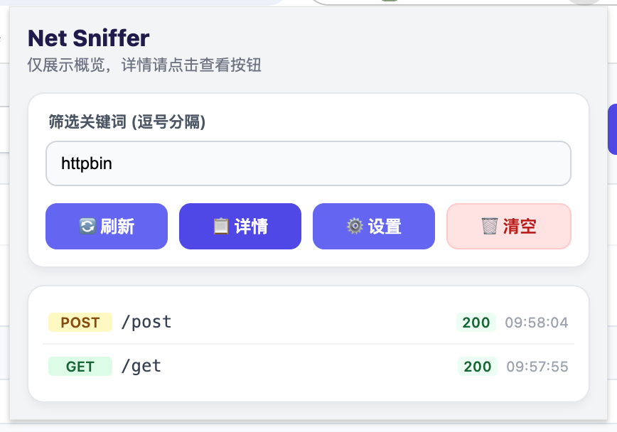
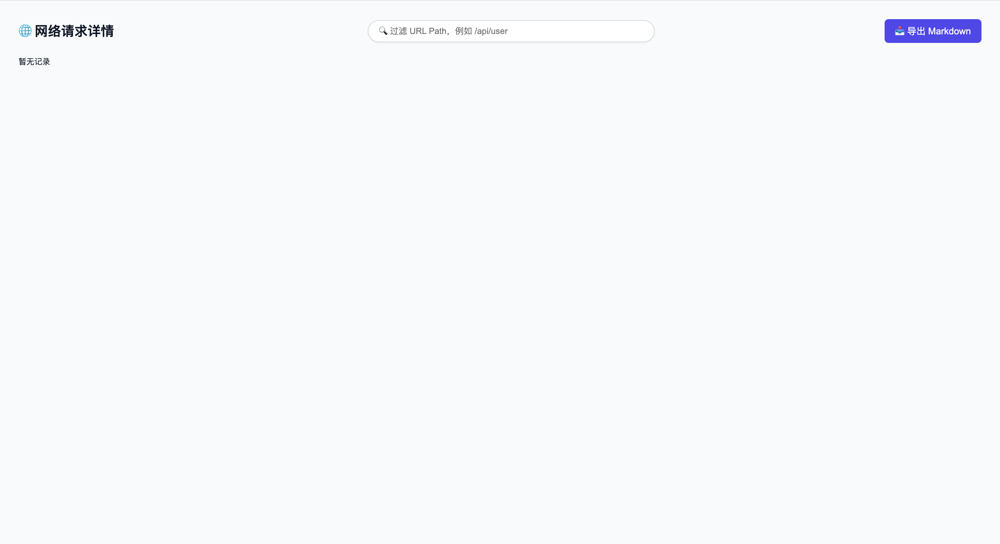
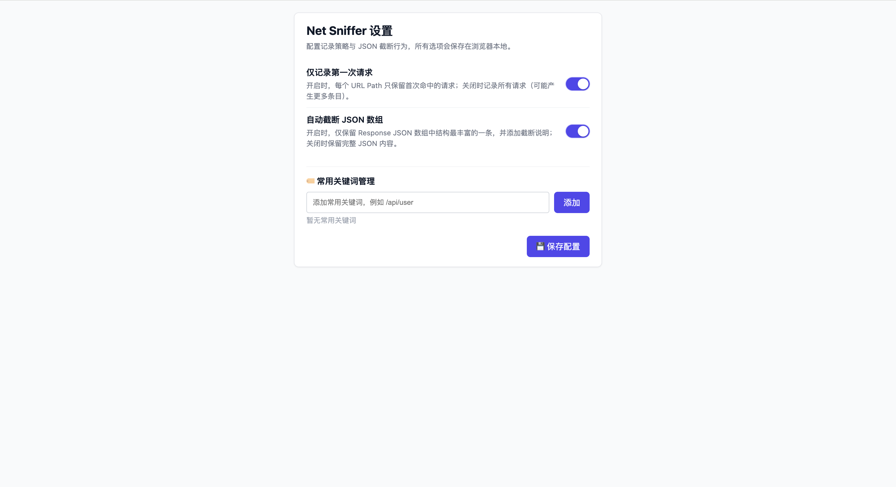

# Net Sniffer (网络请求智能嗅探器)

一个专为 **AI 驱动的自动化测试** 设计的 Chrome 扩展工具。

## 🚀 项目背景

在让 AI 编写自动化测试代码时，我们经常面临以下痛点：
- **参数获取难**：AI 难以准确获取复杂的请求参数和返回结果格式。
- **Debugger 噪音多**：Chrome 自带的 Network 面板请求极其繁杂，重复请求多，且逐个导出极度低效。
- **结构不清晰**：大型项目的返回结果往往嵌套极深，直接丢给 AI 会导致上下文溢出。

**Net Sniffer** 正是为了解决这些问题而生。它通过智能过滤和结构化导出，为 AI 提供最纯净的测试指令集。

## ✨ 核心特性

- **关键词精准过滤**：支持多关键词筛选（逗号分隔），只关注你感兴趣的 API。
- **去重记录逻辑**：仅记录路径唯一的第一次成功请求（Status 200），拒绝历史垃圾信息。
- **AI 友好导出**：一键生成结构化的 Markdown 报告，包含请求头、Payload 和格式化后的 Response，直接作为 AI 的 Context。
- **常用词管理**：在设置页面统一维护常用筛选词，随用随选。

## 📸 效果预览

## 🛠️ 如何使用

1. **安装**：
   - 下载源码或 Release 包。
   - 打开 Chrome `扩展程序` -> 开启 `开发者模式` -> `加载已解压的扩展程序`。
2. **配置**：
   - 右键点击插件图标进入 `选项`，添加你常用的 API 关键词（如 `/api/v1/user`）。
3. **捕获**：
   - 在目标页面点击插件图标（Popup），选择关键词开始实时过滤。
4. **导出**：
   - 点击 `查看详细数据` 进入详情页，点击 `复制 Markdown`，直接粘贴给 AI。

## 🌈 开源愿景

旨在通过简单的嗅探工具，打通“手动操作 -> 流量捕捉 -> AI 代码生成”的闭环，让自动化测试回归本质。
